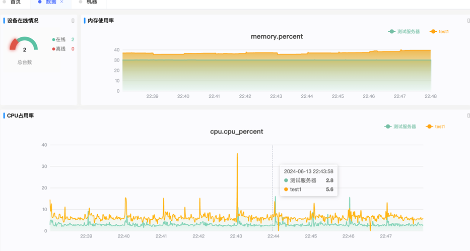
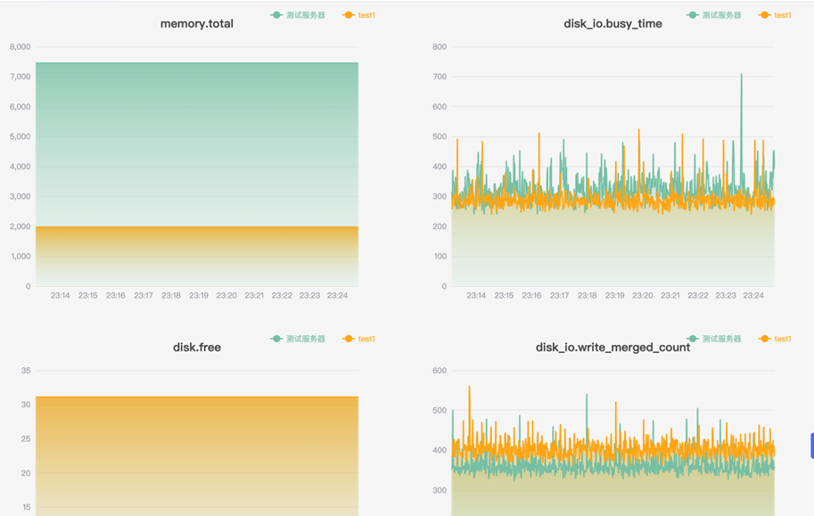
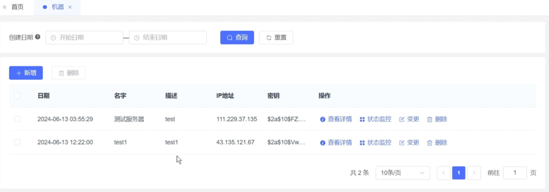
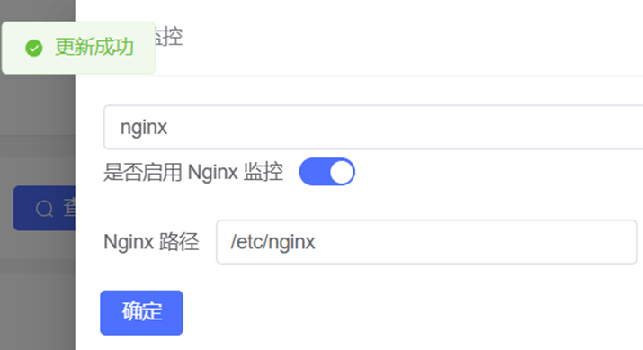
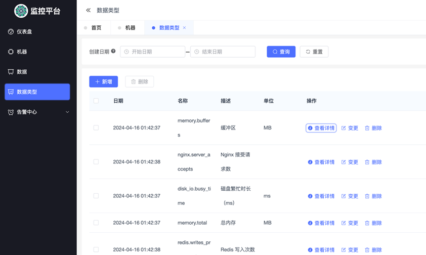
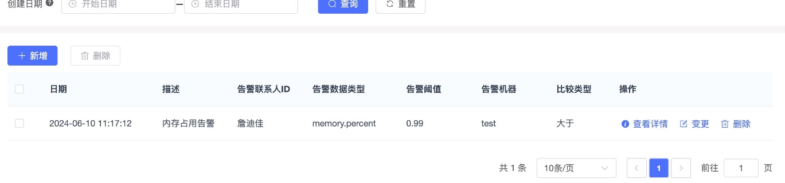

# Monit

## Project Overview

The **Monit** is an system designed to provide **efficient, secure, and easy-to-use tools** for IT system monitoring in a cloud environment. Developed by a dedicated team from the School of Computer Science and Engineering, this project aims to streamline IT operations and boost operational efficiency with intelligent monitoring, smart alerting, and automated machine management.

This platform empowers IT personnel to:

- **Monitor system health**: Assess real-time CPU, memory, and service usage.
- **Collect and display multi-dimensional data**: Gain insights through intuitive, real-time data charts.
- **Automate machine management**: Easily manage multiple machines remotely via an integrated interface.

---

## Key Features

1. **Automated Installation & Deployment**

   - Use **SSH** to deploy agents to remote machines automatically.
   - Compatible with various Linux distributions.

2. **Real-time Data Collection and Monitoring**

   - Collect system hardware usage (CPU, memory, disk, and more).
   - Monitor key service health metrics (e.g., MySQL QPS/TPS, Redis performance).
   - Real-time monitoring dashboard with refresh intervals as low as 10 seconds.

3. **Intelligent Alerts**

   - Easily configure alert thresholds for monitoring metrics.
   - Real-time email notifications and support for enterprise WeChat alert integration.

4. **Decoupled Frontend and Backend Architecture**

   - Frontend built with **Vue.js**.
   - Backend powered by **Go (Gin framework)**, ensuring high performance and scalability.
   - **Python-based Agent** for cross-platform compatibility.

5. **Security Enhancements**
   - Enforce **JWT authentication** for all API operations.
   - Prevent unauthorized access and protect sensitive data.

---

## Tech Stack

### Backend

- **Go**: A modern, efficient programming language for developing high-performance server-side applications.
- **Gin**: Lightweight and powerful web framework for RESTful APIs.
- **Gin-Vue-Admin**: Complete template for building enterprise-grade projects with user management, logging, etc.

### Frontend

- **Vue.js**: Reactive web development framework for building engaging, high-performance UIs.
- **Vue Router**: Seamlessly manage routes in your single-page application.
- **Element UI**: Comprehensive library of prebuilt UI components.

### Monitoring Agent

- **Python**: A flexible, beginner-friendly language for cross-platform compatibility.
- Libraries used in the Agent module:
  - **Paramiko**: Establish remote SSH connections.
  - **Psutil**: Collect operating system metrics such as CPU and memory.
  - **Sqlite3**: Manage local monitor data for offline storage.
  - Others include **PyMySQL** (MySQL data fetching) and **Redis libraries**.

---

## System Architecture

1. **Agent Installation**: Deploy monitoring agents to target machines via SSH.
2. **Data Transmission**: Agents collect system and service metrics and send them to the backend.
3. **Backend Processing**: The backend processes and stores the data while running alert-based checks.
4. **Frontend Visualization**: The frontend allows users to view machine statuses, generate time-based charts, and manage operations.

---

## Getting Started

### Prerequisites

#### Backend

- Go `>= 1.19`
- MySQL (to store monitoring data)
- Redis (optional, for caching)

#### Frontend

- Node.js `>= 16+`
- Vue CLI installed globally (`npm install -g @vue/cli`)

#### Agent Installation

- Target system requirements:
  - OS: Linux (CentOS/Ubuntu/Debian)
  - Python: `>= 3.6`

---

### Deployment

#### Backend Server

1. **Clone the repository**:

   ```bash
   git clone https://github.com/username/project-name.git
   cd project-name/backend
   ```

2. **Configure the environment**:

   ```bash
   cp config.yaml.example config.yaml
   # Edit config.yaml with database, Redis configurations
   ```

3. **Start the backend**:
   ```bash
   go mod tidy
   go run main.go
   ```

#### Frontend

1. **Navigate to the frontend directory**:

   ```bash
   cd ../frontend
   ```

2. **Install dependencies**:

   ```bash
   npm install
   ```

3. **Run in developer mode**:

   ```bash
   npm run serve
   ```

4. **Build for production**:
   ```bash
   npm run build
   ```

#### Deploying the Agent

1. Use the following command to install the Agent on a remote machine:
   ```bash
   python remote.py install --host <IP> --port <SSH_Port> --username <User> --password <Password> --machine-id <UUID>
   ```

---

### Main Functionalities

#### Login:

Start by visiting the platform interface at `http://<server-ip>:<frontend-port>` and log in using:

- **Username**: `admin`
- **Password**: `123456`

#### Machine Management:

- Add new machines via the **machine management page**.
- After successful deployment, manage machine status and monitor metrics remotely.

#### Real-time Monitoring:

Access the **dashboard** to track system metrics like CPU and memory usage, in real-time.

- Refresh cycles as low as 10 seconds.
- Zoom into time periods or examine specific machine stats.

#### Alerts:

Configure custom alert thresholds to receive real-time notifications:

- Alerts are sent via email.
- Integration with enterprise WeChat for instant alerts.

---

## Project Structure

```plaintext
project-name/
├── backend/               # Backend code (Go)
├── frontend/              # Frontend code (Vue.js)
├── agent/                 # Monitoring Agent code (Python)
├── docs/                  # Documentation resources
└── README.md              # Project overview & guide
```

---

# Demo








---

## Core Team

- **Dijia Zhan (詹迪佳)**
- **Yingjin Jiang (江英进)**
- **Xuan Gan (甘轩)**
- **Peng Qian (钱鹏)**

---

## License

This project is licensed under the [MIT License](LICENSE). You're free to use, distribute, and modify the software under these terms.

---

## Contact

For any queries, questions, or suggestions, feel free to:

- Open a GitHub Issue at [GitHub Repo Issues](https://github.com/username/project-name/issues)

Join us in making IT monitoring more seamless and efficient! 🎉
